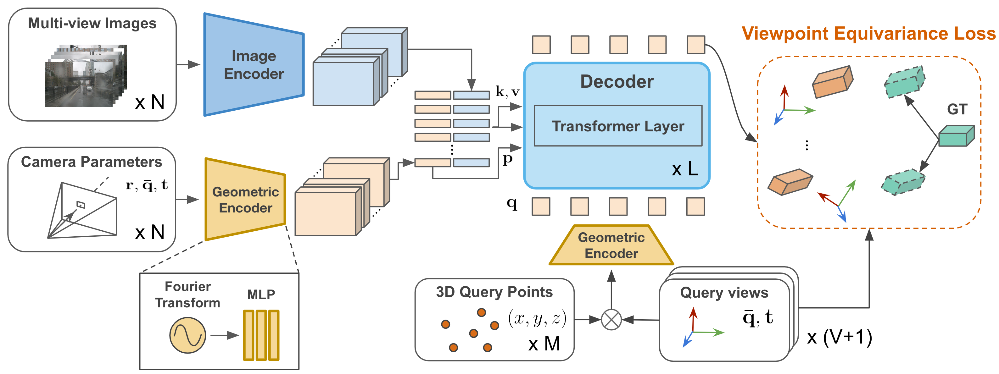

<!-- omit in toc -->
# VEDet: Viewpoint Equivariance for Multi-View 3D Object Detection

This is the official implementation of CVPR 2023 paper [**Viewpoint Equivariance for Multi-View 3D Object Detection**](https://arxiv.org/abs/2303.14548) authored by [Dian Chen](https://scholar.google.com/citations?user=zdAyna8AAAAJ&hl=en), [Jie Li](https://scholar.google.com/citations?user=_I3COxAAAAAJ&hl=en), [Vitor Guizilini](https://scholar.google.com/citations?user=UH9tP6QAAAAJ&hl=en), [Rares Ambrus](https://scholar.google.com/citations?user=2xjjS3oAAAAJ&hl=en), and [Adrien Gaidon](https://scholar.google.com/citations?user=2StUgf4AAAAJ&hl=en), at [Toyota Research Institute](https://www.tri.global/). We introduce viewpoint equivariance on view-conditioned object queries achieving state-of-the-art 3D object performance.

Our code and models will be released soon. Please stay tuned!

<!-- omit in toc -->
## Contents
- [Install](#install)
- [Dataset preparation](#dataset-preparation)
- [Experiments](#experiments)
- [Models](#models)
- [License](#license)
- [Reference](#reference)

## Install

## Dataset preparation

## Experiments

## Models

## License

## Reference